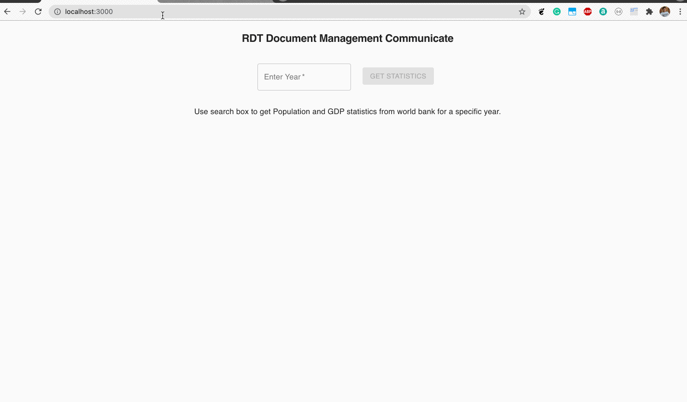

# rdt-document-management

## Assumptions (application is scalable enough to extend for any specific requirements)
- By default api will get data for all countries in 2 separate calls
- Only implemented default sorting and filtering
- Only displaying country name, population and GDP
- Displaying first 50 records only

## Decisions taken
- Instead of page loader used text based message
- For simplicity only handled error scenarios where api failed for any reason and only showing message instead of dedicated error page


## Developers Guide
Contributors can clone this repo using either `https` or `git` protocol as shown below

```
<!-- Clone repo -->
git clone git@github.com:nishant-labs/rdt-document-management.git
git clone https://github.com/nishant-labs/rdt-document-management.git

<!-- Go inside directory -->
cd rdt-document-management

```
Then execute below commands to install and start local server

```
npm install
npm start
```

Once local server is started open url http://localhost:3000/ in a browser to load application and start using it


## Demo Guide

Once application is loaded you can see a text box where you can enter 4 digit year for which you want to see the GDP and population stats

Below gif will help you use this website.




Use [Demo link](https://nishant-labs.github.io/rdt-document-management) for live testing

## Know more about scripts

Read [Scripts readme](docs/README.cra.md)